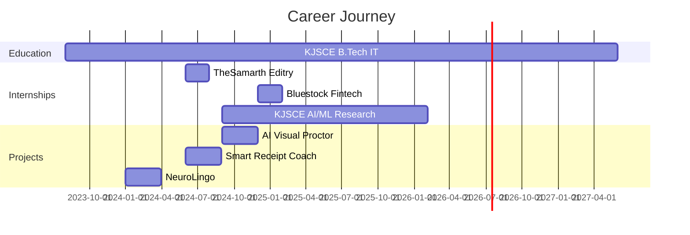

<div align="center">
  
<!-- Animated Header Wave -->


<!-- Typing Animation -->
<a href="https://git.io/typing-svg">
  
</a>

<br/>

<!-- Profile Views & Social Badges -->
<p align="center">
  
  
  
</p>

<!-- Social Links -->
<p align="center">
  <a href="https://portfolio-wine-gamma-97.vercel.app/" target="_blank">
    
  </a>
  <a href="https://www.linkedin.com/in/parth-sharma-16469a293/" target="_blank">
    
  </a>
  <a href="mailto:parth.sharma1@somaiya.edu">
    
  </a>
  <a href="https://github.com/Parths-29" target="_blank">
    
  </a>
</p>

</div>

---

<!-- About Me with Animated GIF -->
##  About Me


```javascript
const parth = {
    location: "Mumbai, India 🇮🇳",
    education: "B.Tech IT @ KJSCE",
    currentCGPA: "9.39/10",
    currentFocus: "AI/ML & Blockchain",
    yearOfStudy: "3rd Year",
    
    workingOn: [
        "Neural Med-Assist (AI Healthcare)",
        "Blockchain DApps",
        "Computer Vision Projects"
    ],
    
    learning: [
        "Deep Learning",
        "Smart Contracts (Solidity)",
        "Advanced System Design"
    ],
    
    futureGoals: [
        "Masters in AI/ML (Germany 🇩🇪)",
        "Contributing to Open Source",
        "Building Production-Grade AI Systems"
    ],
    
    lifePhilosophy: "Learn by building, break things, improve them ♻️"
};
```

<br clear="right"/>

### 🎯 Quick Facts

- 🔭 **Currently Building:** Neural Med-Assist - AI-powered healthcare management system
- 🌱 **Exploring:** Computer Vision, NLP, Smart Contracts & Hyperledger Fabric
- 💡 **Passion:** Turning complex problems into elegant solutions with AI
- 🎓 **Academic Excellence:** Maintained 9.39/10 CGPA | Dean's List
- 🌍 **Dream:** Pursue Masters in AI/ML in Germany
- ⚡ **Fun Fact:** I code better at night with coffee ☕ | GitHub streak enthusiast 🔥

---

## 🛠️ Tech Stack & Tools

### Languages
<p align="left">
  
  
  
  
  
  
</p>

### AI/ML & Data Science
<p align="left">
  
  
  
  
  
  
  
</p>

### Web Development
<p align="left">
  
  
  
  
  
  
  
</p>

### Blockchain & Web3
<p align="left">
  
  
  
</p>

### Tools & Platforms
<p align="left">
  
  
  
  
  
  
  
  
</p>

---

## 🏆 Featured Projects

<div align="center">

| 🤖 AI/ML Projects | 🔗 Blockchain Projects | 🌐 Web Projects |
|:---:|:---:|:---:|
| **AI Visual Proctor** <br/> Computer Vision exam monitoring <br/> `95% accuracy` | **Decentralized Voting DApp** <br/> Ethereum smart contracts <br/> `Solidity + Web3` | **Smart Receipt Coach** <br/> OCR + LLM finance tracker <br/> `React + Node.js` |
| **NeuroLingo** <br/> Emotion analysis system <br/> `NLP + LSTM` | **Hyperledger Healthcare** <br/> Blockchain medical records <br/> `Hyperledger Fabric` | **Hospital Dashboard** <br/> Full-stack health platform <br/> `MERN Stack` |

</div>

---

## 📊 GitHub Statistics

<div align="center">
  
  <!-- GitHub Stats Card -->
  
  
  <!-- Top Languages -->
  

</div>

<div align="center">
  
  <!-- GitHub Streak Stats -->
  

</div>

<div align="center">

  <!-- Activity Graph -->
  

</div>

---

## 🏆 GitHub Trophies

<div align="center">
  
</div>

---

## 📈 Contribution Graph

<div align="center">
  
</div>

<!--START_SECTION:waka-->
<!--END_SECTION:waka-->

---

## 💼 Professional Experience Timeline



---

## 🎯 Current Focus & Learning Path

<table>
  <tr>
    <td valign="top" width="50%">
      
### 🔥 Working On
      
- 🏥 **Neural Med-Assist** - AI Healthcare System
  - Predictive Analytics (88% accuracy)
  - NLP Chatbot with BERT
  - Blockchain Integration
  
- 👁️ **Computer Vision Projects**
  - Real-time object detection
  - Facial recognition systems
  
- 🔗 **Smart Contract Development**
  - Solidity optimization
  - Gas-efficient contracts

    </td>
    <td valign="top" width="50%">
      
### 🌱 Learning
      
- 📚 **Deep Learning Specialization** (DeepLearning.AI)
- 🧠 **Advanced Neural Networks**
  - GANs, Transformers
  - Attention Mechanisms
  
- 🔐 **Blockchain Security**
  - Smart contract auditing
  - Web3 security best practices
  
- 🌐 **System Design**
  - Microservices architecture
  - Scalable distributed systems

    </td>
  </tr>
</table>

---

## 🎓 Certifications & Achievements

<div align="center">

| Certification | Issuer | Year |
|:-------------|:-------|:----:|
| 🏆 Machine Learning Specialization | Stanford University (Coursera) | 2024 |
| 🏆 Deep Learning Specialization (5 courses) | DeepLearning.AI | 2024 |
| 🏆 TensorFlow Developer | Google | In Progress |
| 🎯 Academic Excellence - 9.39/10 CGPA | KJSCE | 2023-Present |
| 🥇 Hackathon Top 10 Finalist | University Level | 2024 |

</div>

---

## 📫 Let's Connect & Collaborate!

<div align="center">

### 💬 I'm always open to:
  
🤝 Collaborating on **AI/ML projects** | 💡 Discussing **innovative ideas** | 🚀 **Open source** contributions | 🎓 **Research opportunities**

<br/>

### 📧 Reach Out:

**📬 Email:** [parth.sharma1@somaiya.edu](mailto:parth.sharma1@somaiya.edu)  
**💼 LinkedIn:** [Connect with me](https://www.linkedin.com/in/parth-sharma-16469a293/)  
**🌐 Portfolio:** [View my work](https://portfolio-wine-gamma-97.vercel.app/)  
**🐙 GitHub:** [@Parths-29](https://github.com/Parths-29)

<br/>

### ☕ Support My Work

If you like my projects, consider giving them a ⭐!  
Every star motivates me to create more awesome stuff! 🚀

<a href="https://www.buymeacoffee.com/parthsharma" target="_blank">
  
</a>

</div>

---

## 📊 Weekly Development Breakdown

<!--START_SECTION:waka-->
```text
Python       12 hrs 30 mins  ███████████░░░░░░░░░░░░░   45.2%
JavaScript   8 hrs 15 mins   ███████░░░░░░░░░░░░░░░░░   29.8%
Solidity     3 hrs 45 mins   ███░░░░░░░░░░░░░░░░░░░░░   13.5%
TypeScript   2 hrs 10 mins   ██░░░░░░░░░░░░░░░░░░░░░░    7.8%
Other        1 hr 5 mins     █░░░░░░░░░░░░░░░░░░░░░░░    3.7%
```
<!--END_SECTION:waka-->

---

## 🐍 Contribution Snake

<picture>
  <source media="(prefers-color-scheme: dark)" srcset="https://raw.githubusercontent.com/Parths-29/Parths-29/output/github-contribution-grid-snake-dark.svg">
  <source media="(prefers-color-scheme: light)" srcset="https://raw.githubusercontent.com/Parths-29/Parths-29/output/github-contribution-grid-snake.svg">
  
</picture>

---

## 💭 Random Dev Quote

<div align="center">


</div>

---

## 🎵 Spotify Playing

<div align="center">

[](https://open.spotify.com/user/31k7cbom3qhq6ycovg4wopixndne)

</div>

---

<div align="center">

### 🌟 "First, solve the problem. Then, write the code." - John Johnson

### Thanks for visiting! 😊


</div>
